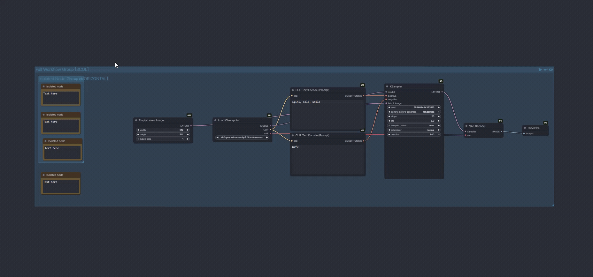

# ComfyUI Node Organizer

Automatically organizes nodes in your workflow using a compact hierarchical layout.

### Preview of organizing a workflow

### Preview of organizing groups with tokens

## Installation

1. Open **ComfyUI**
2. Go to **Manager > Custom Node Manager**
3. Search for `Node Organizer`
4. Click **Install**

## Usage

Right-click on the canvas and select **Organize Workflow**.

To organize specific groups, select them and choose **Organize Group**.

## Group Layout Tokens

Add tokens to group titles to control how nodes are arranged:

| Token | Effect |
|-------|--------|
| `[HORIZONTAL]` | Single horizontal row |
| `[VERTICAL]` | Single vertical column |
| `[2ROW]`...`[9ROW]` | Distribute into N rows |
| `[2COL]`...`[9COL]` | Distribute into N columns |

**Examples:**
- `"My Loaders [HORIZONTAL]"` - arranges all nodes in a single row
- `"Processing [3COL]"` - distributes nodes into 3 columns

**Notes:**
- Tokens are case-insensitive (`[horizontal]` works)
- `[1ROW]` = `[HORIZONTAL]`, `[1COL]` = `[VERTICAL]`
- Nested groups each respect their own tokens
- Groups without tokens use default DAG-based layout

## Features

- **Execution Order Layout**: Nodes arranged left-to-right following data flow
- **Compact Bin Packing**: Reduces vertical height by packing nodes into rows
- **Disconnected Node Handling**: Annotations, bookmarks placed in separate left margin
- **Reroute Optimization**: Reroute chains collapsed and restored along edges
- **Group Support**: Nested groups with proper hierarchy
- **Group Layout Tokens**: Control layout with title tokens (see below)
- **Subgraph Support**: Works inside subgraphs with I/O node handling

## Known Limitations

This extension has not been thoroughly tested with very large or complex workflows. If you encounter issues, please [open a GitHub issue](https://github.com/PBandDev/comfyui-node-organizer/issues) with a **minimal reproducible workflow** attached.